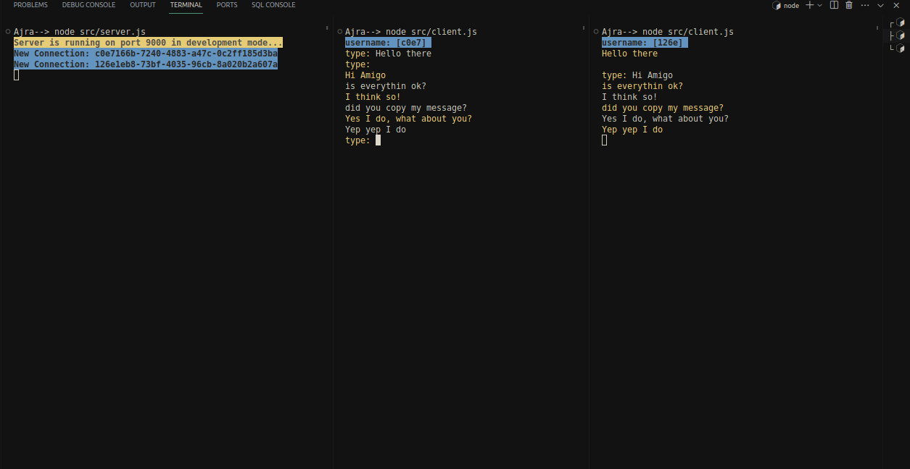

# `Building Chat Room with Node.js stream In Terminal`

## Getting started

This a `terminal based chatroom`, no third party library has been used.
It is entirly built with node.js native modules.I've used the one of the most important node.js fetaure which is **Node.js stream** along with the **net module**.

**Usage**:

clone the repo then open your terminal or your embedded terminal if you are using **vscode**.

`node src/server.js // to start the server`

To see the messaging workflow you better split your terminal into multiple
windows.

`node src/client.js // type this command into all the opened terminal windows`

## Demo

